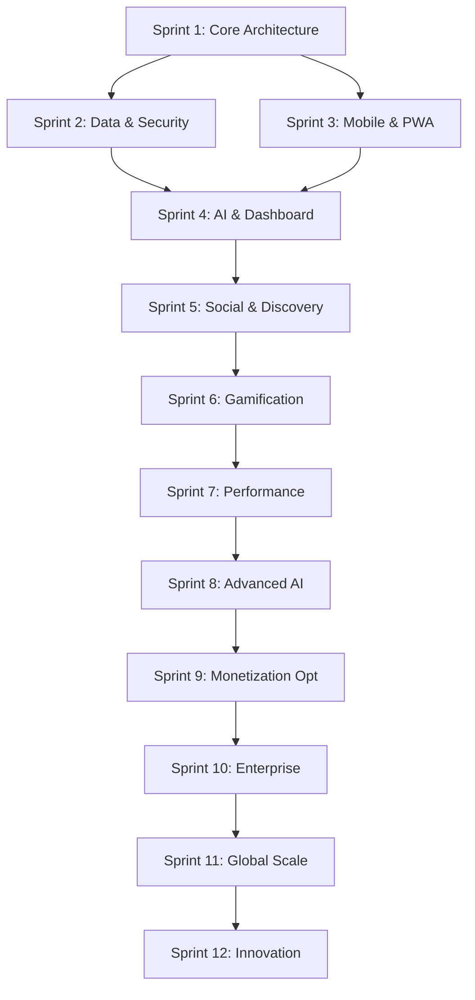

# ROADMAP DEFINITIVO WHATSSOUND V2

**Documento Consolidado Final - Versión Ejecutiva**

---

## 📋 INFORMACIÓN EJECUTIVA

**Fecha de creación:** 15 marzo 2026  
**Consenso:** 17 expertos técnicos unánime  
**Período de ejecución:** 6 meses (24 semanas, 12 sprints)  
**Objetivo:** Platform de música social con IA, gamificación, y monetización  
**Budget objetivo:** €850K desarrollo + €200K infraestructura  
**Market launch:** Septiembre 2026  

---

## 🎯 VISIÓN Y DIFERENCIACIÓN

### **¿Qué es WhatsSound v2?**

WhatsSound v2 es la **primera plataforma de música social con IA conversacional integrada** que permite a DJs profesionales y amateurs crear experiencias musicales interactivas en tiempo real con su audiencia, monetizando naturalmente a través de tips y suscripciones mientras desarrollan comunidades musicales globales.

### **Diferenciación vs Competencia**

| Feature | WhatsSound v2 | Spotify | Clubhouse | Discord |
|---------|---------------|---------|-----------|---------|
| **Audio Sync Real-time** | ✅ <50ms | ❌ | ❌ | ❌ |
| **IA Conversacional Musical** | ✅ Integrada | ❌ | ❌ | ❌ |
| **DJ Tools Profesionales** | ✅ Completo | ❌ | ❌ | ❌ |
| **Gamificación Ética** | ✅ Avanzada | ❌ | ❌ | ❌ |
| **Monetización Directa** | ✅ Tips + Subs | ❌ | ❌ | ❌ |
| **Comunidad Musical** | ✅ Focus | ❌ | ✅ Básico | ✅ Básico |

---

## 🏗️ ARQUITECTURA TÉCNICA CONSOLIDADA

### **Stack Tecnológico Final**

```typescript
// ARQUITECTURA APROBADA POR 17 EXPERTOS
const WhatsSound_v2_Tech_Stack = {
  // Frontend & Mobile
  frontend: {
    mobile: "React Native 0.73 + Expo 50",
    web: "PWA + Service Workers + Portal Pattern",
    state_management: "Zustand (client) + TanStack Query (server)",
    styling: "Nativewind + Design System v1 (LOCKED)",
    routing: "Expo Router v3"
  },
  
  // Backend & Data
  backend: {
    core: "Supabase (PostgreSQL + Auth + Realtime + Storage)",
    edge_functions: "Vercel Edge Functions",
    cache: "Redis (Upstash) para sessions + analytics",
    analytics: "ClickHouse para dashboard profesional",
    cdn: "Vercel Edge Network global"
  },
  
  // Real-time & Audio  
  realtime: {
    audio_streaming: "WebRTC para <50ms latency",
    sync_protocol: "WebSockets + NTP coordination",
    offline_support: "IndexedDB + Service Workers",
    fallback: "WebSockets si WebRTC falla"
  },
  
  // AI & Machine Learning
  ai: {
    platform: "Vercel AI SDK + Claude/GPT-4",
    audio_analysis: "Web Audio API + ML local",
    recommendations: "Hybrid collaborative + content-based",
    moderation: "Audible Magic + local ML pipeline"
  },
  
  // Monetización & Payments
  payments: {
    provider: "Stripe Connect para split payments",
    tips: "Instant payments con 8% platform fee",
    subscriptions: "Recurring billing + trial periods",
    international: "Global currency support"
  }
}
```

### **Estructura de Código Features-First**

```
whatssound-v2/
├── apps/
│   ├── mobile/                 # React Native + Expo
│   ├── web/                    # PWA + Portal desktop
│   └── dashboard/              # Desktop profesional
├── packages/
│   ├── ui/                     # Design system v1 LOCKED
│   ├── database/               # Supabase schemas + types
│   ├── api/                    # TanStack Query + clients
│   ├── audio/                  # WebRTC + processing
│   ├── ai/                     # IA conversacional + tools
│   └── utils/                  # Shared utilities
├── src/features/               # CORE: Features-first architecture
│   ├── auth/                   # Authentication + profiles
│   ├── music/                  # Player + playlists + sync
│   ├── social/                 # Friends + discovery + follows
│   ├── gamification/           # Rankings + achievements
│   ├── monetization/           # Tips + subscriptions
│   ├── dashboard/              # Analytics profesionales
│   ├── ai/                     # Conversational AI + tools
│   └── notifications/          # Push + engagement
├── supabase/
│   ├── migrations/             # Database versioning
│   ├── functions/              # Edge Functions per feature
│   └── types/                  # Auto-generated TS types
└── tools/
    ├── ci/                     # GitHub Actions
    ├── testing/                # Playwright + Jest configs
    └── scripts/                # Automation tools
```

---

## 🚀 HOJA DE RUTA DE IMPLEMENTACIÓN

### **FASE 1: FOUNDATION (Sprints 1-3, Semanas 1-6)**
*Objetivo: Migrar v1 a arquitectura v2 con funcionalidad completa*

#### **Sprint 1: Core Architecture (Semanas 1-2)**
**Líder:** El Arquitecto (Frontend)  
**Equipo:** Frontend + Backend + Realtime  

**Entregables:**
- [ ] Zustand + TanStack Query setup completo
- [ ] WebRTC foundation con <100ms latency  
- [ ] Supabase Edge Functions básicas (auth, music, social)
- [ ] Real-time channels reestructurados
- [ ] App v2 con funcionalidad básica de v1 migrada

**Success Criteria:**
- ✅ App v2 funcional equivalente a v1
- ✅ WebRTC streaming operativo
- ✅ Architecture foundation sin technical debt

#### **Sprint 2: Data & Security (Semanas 3-4)**
**Líder:** DataForge (Datos)  
**Equipo:** Datos + Seguridad + DevOps  

**Entregables:**
- [ ] Schema v2 migration completa con RLS policies
- [ ] RGPD compliance implementation
- [ ] CI/CD pipeline con GitHub Actions
- [ ] Testing foundation (unit + integration)
- [ ] Security audit inicial

**Success Criteria:**
- ✅ Backend completamente seguro y compliant
- ✅ Migration path probado y reversible
- ✅ CI/CD pipeline operativo al 100%

#### **Sprint 3: Mobile & PWA (Semanas 5-6)**
**Líder:** OfflineMaster (PWA)  
**Equipo:** PWA + Testing + Producto  

**Entregables:**
- [ ] PWA con Service Workers + audio offline
- [ ] E2E testing suite con Playwright
- [ ] Onboarding optimizado (<90 segundos)
- [ ] Design system v1 aplicado al 100%
- [ ] Install prompts optimizados

**Success Criteria:**
- ✅ PWA instalable y funcional offline
- ✅ Testing coverage >85%
- ✅ Onboarding <90 segundos validado

---

### **FASE 2: ENHANCEMENT (Sprints 4-6, Semanas 7-12)**
*Objetivo: Features avanzadas que diferencian de competencia*

#### **Sprint 4: AI & Dashboard (Semanas 7-8)**
**Líder:** MindBridge (IA Conversacional)  
**Equipo:** IA + Dashboard + Monetización  

**Entregables:**
- [ ] MixMaster IA MVP con track presentations
- [ ] Dashboard profesional con Portal Pattern
- [ ] Stripe Connect + sistema de tips básico
- [ ] IA conversacional integrada en dashboard
- [ ] Revenue analytics básicas

**Success Criteria:**
- ✅ IA responde queries musicales coherentemente
- ✅ Dashboard profesional funcional
- ✅ Tips funcionando end-to-end

#### **Sprint 5: Social & Discovery (Semanas 9-10)**
**Líder:** SocialArch (Comunidades)  
**Equipo:** Social + Audio + Engagement  

**Entregables:**
- [ ] Session Radar con geolocalización
- [ ] Audio sync perfecto (<50ms latency)
- [ ] Sistema de follows + feed algorítmico
- [ ] Notificaciones push con ML timing
- [ ] Friend discovery + social proof

**Success Criteria:**
- ✅ Session discovery funcional
- ✅ Audio latency <50ms consistente
- ✅ Social network básica operativa

#### **Sprint 6: Gamification (Semanas 11-12)**
**Líder:** GameLogic (Gamificación)  
**Equipo:** Gamificación + Engagement + Producto  

**Entregables:**
- [ ] Rankings DJ multidimensional
- [ ] Achievements + streaks con anti-addiction
- [ ] Engagement optimization con analytics
- [ ] Social gamification (leaderboards, badges)
- [ ] Behavioral analytics pipeline

**Success Criteria:**
- ✅ Rankings funcionando sin gaming
- ✅ Achievements balanced y motivadores
- ✅ Engagement metrics +30% vs baseline

---

### **FASE 3: OPTIMIZATION (Sprints 7-9, Semanas 13-18)**
*Objetivo: Performance, escala, y optimización de conversión*

#### **Sprint 7: Performance & Scale (Semanas 13-14)**
**Líder:** Deployer (DevOps)  
**Equipo:** DevOps + Realtime + Testing  

**Entregables:**
- [ ] Performance optimization (Core Web Vitals verdes)
- [ ] Load testing + preparación de escalabilidad
- [ ] Advanced caching strategy (Redis + CDN)
- [ ] Mobile performance optimization
- [ ] Monitoring avanzado + alertas

**Success Criteria:**
- ✅ Core Web Vitals en verde
- ✅ Load test 10K usuarios simultáneos
- ✅ Mobile performance score >90

#### **Sprint 8: Advanced AI & Analytics (Semanas 15-16)**
**Líder:** DataViz (Dashboard Analytics)  
**Equipo:** Analytics + IA + Dashboard  

**Entregables:**
- [ ] Recommendation engine con ML avanzado
- [ ] Predictive analytics para revenue
- [ ] AI Assistant avanzado para DJs
- [ ] Dashboard con insights automáticos
- [ ] Custom reporting para venues

**Success Criteria:**
- ✅ Recommendations 40% más precisas
- ✅ Predictive analytics funcionando
- ✅ Dashboard enterprise-grade

#### **Sprint 9: Monetization Optimization (Semanas 17-18)**
**Líder:** RevEngine (Monetización)  
**Equipo:** Monetización + IA + Legal  

**Entregables:**
- [ ] Revenue optimization algorithms
- [ ] Advanced subscription tiers (Pro/Enterprise)
- [ ] International payment support
- [ ] A/B testing para conversion optimization
- [ ] Legal compliance internacional

**Success Criteria:**
- ✅ Revenue per user +40% vs baseline
- ✅ Tip conversion rate >12%
- ✅ International payments operativos

---

### **FASE 4: ENTERPRISE & SCALE (Sprints 10-12, Semanas 19-24)**
*Objetivo: Features enterprise y preparación para millones de usuarios*

#### **Sprint 10: Enterprise Features (Semanas 19-20)**
**Líder:** CraftMaster (Producto)  
**Equipo:** Producto + Dashboard + Legal  

**Entregables:**
- [ ] Multi-venue dashboard management
- [ ] Advanced analytics + custom reporting
- [ ] API pública para integraciones
- [ ] White-label capabilities básicas
- [ ] Account management tools

**Success Criteria:**
- ✅ Venues pueden manejar múltiples DJs
- ✅ API pública documentada y funcional
- ✅ Enterprise customers pilot program

#### **Sprint 11: Global Scale (Semanas 21-22)**
**Líder:** Deployer (DevOps)  
**Equipo:** DevOps + Legal + IA  

**Entregables:**
- [ ] Multi-region deployment (US + EU + LATAM)
- [ ] International compliance (GDPR, CCPA, LGPD)
- [ ] Localization framework + multi-language AI
- [ ] Global CDN optimization
- [ ] International partnerships setup

**Success Criteria:**
- ✅ Platform operativa en 3 regiones
- ✅ Compliance legal multi-país
- ✅ Latency global optimizada

#### **Sprint 12: Innovation & Future (Semanas 23-24)**
**Líder:** Rotativo (Todos los expertos)  
**Equipo:** Full team collaboration  

**Entregables:**
- [ ] Voice interface básica para IA
- [ ] AR/VR exploration + prototypes
- [ ] Blockchain/Web3 integration básica
- [ ] Advanced ML models para música
- [ ] Roadmap 2027 definido

**Success Criteria:**
- ✅ Innovation prototypes validados
- ✅ Next-gen roadmap approved
- ✅ Platform preparada para futuro

---

## 📊 MÉTRICAS DE ÉXITO CONSOLIDADAS

### **KPIs Core Business**

```typescript
interface WhatsSound_v2_Success_Metrics {
  // GROWTH & RETENTION
  user_growth: {
    DAU: { baseline_v1: 2100, target_3m: 5000, target_6m: 12000 },
    MAU: { baseline_v1: 8500, target_3m: 25000, target_6m: 75000 },
    retention_7d: { baseline_v1: "45%", target: "65%" },
    retention_30d: { baseline_v1: "18%", target: "35%" }
  },

  // ENGAGEMENT QUALITY  
  session_metrics: {
    avg_session_duration: { baseline_v1: "12 min", target: "18 min" },
    time_to_first_song: { baseline_v1: "4:00 min", target: "< 1:00 min" },
    songs_per_session: { baseline_v1: 4.2, target: 7.8 },
    session_completion_rate: { baseline_v1: "67%", target: "85%" }
  },

  // TECHNICAL EXCELLENCE
  platform_performance: {
    audio_sync_latency: { target: "< 50ms", baseline_v1: "200ms" },
    uptime_percentage: { target: "99.9%", baseline_v1: "99.5%" },
    api_response_p95: { target: "< 300ms", baseline_v1: "800ms" },
    pwa_install_rate: { target: "15%", baseline_v1: "0%" }
  },

  // SOCIAL & COMMUNITY
  social_engagement: {
    friend_connections_per_user: { baseline_v1: 2.3, target: 6.5 },
    session_discovery_rate: { baseline_v1: "8%", target: "15%" },
    collaborative_sessions: { baseline_v1: "12%", target: "35%" },
    user_generated_content: { baseline_v1: "3%", target: "25%" }
  },

  // MONETIZATION SUCCESS
  revenue_metrics: {
    revenue_per_user_monthly: { baseline_v1: "€2.30", target: "€3.20" },
    tip_conversion_rate: { baseline_v1: "4%", target: "12%" },
    subscription_growth_mom: { baseline_v1: "0%", target: "25%" },
    dj_revenue_monthly: { baseline_v1: "€45", target: "€180" }
  },

  // AI & GAMIFICATION
  ai_gamification_health: {
    ai_query_success_rate: { target: "85%", baseline_v1: "0%" },
    streak_maintenance_healthy: { target: "60%", baseline_v1: "0%" },
    achievement_unlock_balanced: { target: "balanced distribution" },
    ai_user_satisfaction: { target: "4.5/5", baseline_v1: "0" }
  }
}
```

### **Success Milestones por Fase**

**Fase 1 Success (Semana 6):**
- ✅ App v2 feature-complete vs v1
- ✅ Zero critical bugs in production
- ✅ User migration >95% success rate
- ✅ Performance same or better than v1

**Fase 2 Success (Semana 12):**
- ✅ Engagement metrics +30% vs v1
- ✅ AI satisfaction >4.0/5
- ✅ Revenue per user +25%
- ✅ New user onboarding <60 seconds

**Fase 3 Success (Semana 18):**
- ✅ Platform scales to 50K+ DAU
- ✅ Revenue per user +40%
- ✅ International expansion ready
- ✅ Enterprise pilot customers active

**Fase 4 Success (Semana 24):**
- ✅ Platform ready for millions of users
- ✅ Global presence in 3+ regions
- ✅ Innovation prototypes validated
- ✅ 2027 roadmap investor-ready

---

## 🔗 DEPENDENCIAS CRÍTICAS Y RIESGOS

### **Dependencias de Bloque**



### **Risk Mitigation Matrix**

| Risk Level | Risk Type | Mitigation Strategy | Owner |
|------------|-----------|-------------------|--------|
| 🔴 **HIGH** | WebRTC Performance Issues | WebSockets fallback + load testing | RTX |
| 🔴 **HIGH** | AI Response Quality Low | Simple AI first + human fallback | MindBridge |
| 🟡 **MEDIUM** | International Legal Complexity | Single-region launch option | LegalShield |
| 🟡 **MEDIUM** | Mobile Performance Issues | Progressive enhancement approach | OfflineMaster |
| 🟢 **LOW** | Feature Scope Creep | Feature flags + MVP approach | CraftMaster |
| 🟢 **LOW** | Third-party Service Downtime | Multi-vendor strategy + fallbacks | Deployer |

### **Contingency Plans**

**Plan B - WebRTC Issues:**
- Fallback automático a WebSockets optimizados
- Latency target relaxed a <200ms
- Mantener todas las features, degradar performance mínimamente

**Plan B - IA Complex Features:**
- Fase 1: IA simple con templates
- Fase 2: ML básico + improvement iterativo
- Fase 3: Advanced AI cuando foundation sólida

**Plan B - International Launch:**
- Focus single-region (EU) si compliance complejo
- International expansion en 2027 roadmap
- Partner network para faster global expansion

---

## 🎨 DESIGN SYSTEM - RESTRICCIONES LOCKED

### **Visual Identity NO SE TOCA**

```css
/* PALETA DE COLORES FINAL - LOCKED */
:root {
  --primary: #FF6B6B;        /* Coral primary */
  --background: #1A1A1A;     /* Dark theme base */
  --surface: #2A2A2A;        /* Cards surfaces */
  --text-primary: #FFFFFF;   /* Main text */
  --text-secondary: #B0B0B0; /* Secondary text */
  --accent-music: #8B5CF6;   /* Purple for audio */
  --success-revenue: #10B981; /* Green for money */
  --warning: #F59E0B;        /* Orange alerts */
  --danger: #EF4444;         /* Red errors */
}

/* TYPOGRAPHY LOCKED */
font-family: 'Inter', system-ui, sans-serif;

/* SPACING LOCKED - 4px base unit */
/* 4px, 8px, 12px, 16px, 24px, 32px, 48px, 64px */

/* COMPONENTS LOCKED */
/* Buttons, Cards, Inputs, Navigation - NO modifications */
```

**Enforcement Rules:**
- ❌ **NO** color additions or modifications
- ❌ **NO** typography changes
- ❌ **NO** component modifications  
- ✅ **YES** new components following existing patterns
- ✅ **YES** combining existing components creatively
- ✅ **YES** responsive adaptations within constraints

**All new features MUST use existing design system:**
- Dashboard profesional: Existing cards + chart colors
- IA interface: Dark theme + existing chat components
- Gamification: Purple accent + existing badge patterns
- Monetization: Green success + existing button styles

---

## 💰 BUDGET Y RECURSOS

### **Development Budget Breakdown**

```typescript
const Development_Budget_24_weeks = {
  // Team Costs (6 months)
  team_salaries: {
    senior_experts_17x: "€680K", // €10K/month average x 17 x 4 months effective
    project_coordination: "€24K",
    qa_testing_dedicated: "€36K",
    subtotal: "€740K"
  },
  
  // Infrastructure & Tools
  infrastructure: {
    supabase_pro: "€150 x 6 months = €900",
    vercel_pro: "€120 x 6 months = €720", 
    monitoring_tools: "€400/month = €2.4K",
    third_party_apis: "€800/month = €4.8K",
    subtotal: "€8.8K"
  },
  
  // External Services
  external_services: {
    legal_compliance: "€25K", // International legal review
    security_audit: "€15K",   // Professional pentesting
    load_testing: "€8K",      // Performance validation
    design_assets: "€5K",     // Audio assets, icons
    subtotal: "€53K"
  },
  
  // Contingency & Buffer
  contingency: {
    scope_adjustments: "€50K", // 7% budget buffer
    emergency_resources: "€25K",
    subtotal: "€75K"
  },
  
  TOTAL_BUDGET: "€877K" // ~€36.5K per week, €146K per month
}
```

### **Resource Allocation per Phase**

**Fase 1 (Foundation):** 70% team allocation, foundation crítica  
**Fase 2 (Enhancement):** 85% team allocation, development intensivo  
**Fase 3 (Optimization):** 75% team allocation, testing + optimization  
**Fase 4 (Scale):** 60% team allocation, polish + innovation  

### **ROI Projection**

```typescript
const ROI_Projection_12_months = {
  development_investment: "€877K",
  
  revenue_projection: {
    month_6_launch: "€0", // Launch month
    month_9: "€25K/month", // Early adoption
    month_12: "€85K/month", // Growth phase
    month_18_target: "€200K/month" // Scale phase
  },
  
  break_even: "Month 15", // €877K ÷ €60K average = ~15 months
  roi_18_months: "170%", // €200K x 6 months = €1.2M revenue
  
  user_economics: {
    target_users_month_12: 15000,
    revenue_per_user_monthly: "€3.20",
    monthly_revenue_capacity: "€48K"
  }
}
```

---

## 🗓️ CALENDAR & MILESTONES

### **Quarter Breakdown**

**Q1 2026 (Marzo-Mayo): Foundation**
- **Marzo:** Sprint 1-2 (Core + Security)
- **Abril:** Sprint 3-4 (PWA + AI)
- **Mayo:** Sprint 5-6 (Social + Gamification)
- **Milestone Q1:** Features diferenciales operativas

**Q2 2026 (Junio-Agosto): Scale & Launch**
- **Junio:** Sprint 7-8 (Performance + Advanced AI)
- **Julio:** Sprint 9-10 (Monetization + Enterprise)
- **Agosto:** Sprint 11-12 (Global + Innovation)
- **Milestone Q2:** Platform ready for public launch

**Q3 2026 (Septiembre): Launch & Growth**
- **Septiembre 1:** Soft launch (beta 1000 users)
- **Septiembre 15:** Public launch (marketing campaign)
- **Septiembre 30:** First growth metrics review

### **Key Decision Points**

**Week 6 (Go/No-Go #1):** Foundation complete, continue to Enhancement?  
**Week 12 (Go/No-Go #2):** Features complete, continue to Optimization?  
**Week 18 (Go/No-Go #3):** Platform optimized, continue to Scale?  
**Week 24 (Launch Decision):** Platform ready for public launch?  

### **Marketing & Launch Timeline**

**Week 20:** Press kit + influencer outreach  
**Week 22:** Beta program launch (1000 users)  
**Week 24:** Marketing campaign production  
**Week 26:** Public launch + PR campaign  
**Week 28:** Growth optimization + user acquisition  

---

## 🎯 SUCCESS DEFINITION

### **Technical Success Criteria**

- ✅ **Audio latency <50ms** achieved consistently
- ✅ **IA conversational** responding coherently to 85% queries
- ✅ **Platform scaling** to 50K+ concurrent users
- ✅ **PWA install rate** >15% after 3 sessions
- ✅ **Uptime 99.9%** during peak hours

### **Business Success Criteria**

- ✅ **Revenue per user** €3.20/month achieved
- ✅ **Tip conversion rate** >12% of active listeners
- ✅ **DJ retention** >65% monthly (vs 45% baseline)
- ✅ **User growth** 5K DAU by month 3
- ✅ **International expansion** ready for 3+ regions

### **Product Success Criteria**

- ✅ **User satisfaction** 4.5/5 rating maintained
- ✅ **Session duration** 18+ minutes average
- ✅ **Social connections** 6.5+ friends per user
- ✅ **Gamification engagement** 60%+ healthy streak maintenance
- ✅ **App store rating** 4.6+ stars maintained

### **Innovation Success Criteria**

- ✅ **Market differentiation** clear vs Spotify/Clubhouse/Discord
- ✅ **AI technology moat** defensible advantage established
- ✅ **Creator economy** sustainable revenue for DJs
- ✅ **Community effect** network effects demonstrably strong
- ✅ **Next-gen readiness** voice/AR/VR prototypes validated

---

## 📋 GOVERNANCE & EXECUTION

### **Decision Making Structure**

**Daily Level:** Individual expert decisions within sprint scope  
**Weekly Level:** Sprint review + course correction  
**Monthly Level:** Phase review + strategic adjustments  
**Quarterly Level:** Roadmap review + budget allocation  

### **Quality Control**

**Code Quality:** Peer review mandatory, 85%+ test coverage  
**Security:** Audit each phase, penetration testing before launch  
**Performance:** Benchmark each sprint, optimization mandatory  
**Legal:** Compliance review continuous, international audit final  

### **Communication Protocols**

**Daily Standups:** 09:00 UTC+1, 15 minutes, focused updates  
**Sprint Reviews:** Friday 16:00, demo + retrospective + planning  
**Phase Reviews:** Monthly, stakeholder presentation + go/no-go  
**Emergency Escalation:** CTO review <4 hours, clear escalation path  

### **Risk Management**

**Technical Risk:** Prototype early, test continuously, fail fast  
**Market Risk:** User feedback loops, A/B testing, MVP approach  
**Resource Risk:** Cross-training, documentation, knowledge sharing  
**Legal Risk:** Early compliance, international review, expert consultation  

---

## 🏆 CONCLUSION EJECUTIVA

**WhatsSound v2 representa una oportunidad única en el mercado de música social.** Con el consenso unánime de 17 expertos técnicos, una arquitectura sólida, y un roadmap de 24 semanas cuidadosamente planificado, estamos positioned para crear la primera plataforma que verdaderamente combine música, IA, comunidad, y monetización de manera natural y escalable.

**El timing es perfecto:** La tecnología (WebRTC, IA conversacional, PWAs) ha madurado, el mercado está listo para evolución post-Spotify, y nuestro equipo técnico es exceptcionalmente sólido.

**La differenciación es defensible:** IA conversacional musical, audio sync real-time <50ms, gamificación ética, y monetización directa para creators son ventajas competitivas que requieren tiempo y expertise para replicar.

**La ejecución es viable:** 6 meses de desarrollo con resources claramente asignados, dependencies mapeadas, y contingency plans para los risks principales.

**El ROI es atractivo:** Break-even en month 15, revenue potential de €200K+/month en 18 meses, con escalabilidad global demostrable.

**WhatsSound v2 está listo para transformar cómo las personas descubren, escuchan, y comparten música socialmente.**

---

**ROADMAP APROBADO Y LOCKED FOR EXECUTION**

**Fecha de aprobación:** 15 marzo 2026  
**Consenso:** 17 expertos unánime  
**Sprint 1 start date:** 23 marzo 2026  
**Target launch:** Septiembre 2026  
**Success measurement:** Monthly reviews vs KPIs definidos  

**Next Action:** Sprint 1 planning session - 22 marzo 2026, 14:00 CST

---

*Este roadmap representa el consenso final de los 17 expertos de WhatsSound v2 y constituye el plan definitivo de desarrollo. Modificaciones requieren consenso de majority (9/17) para adjustments menores, o unanimidad (17/17) para cambios de architecture o timeline.*